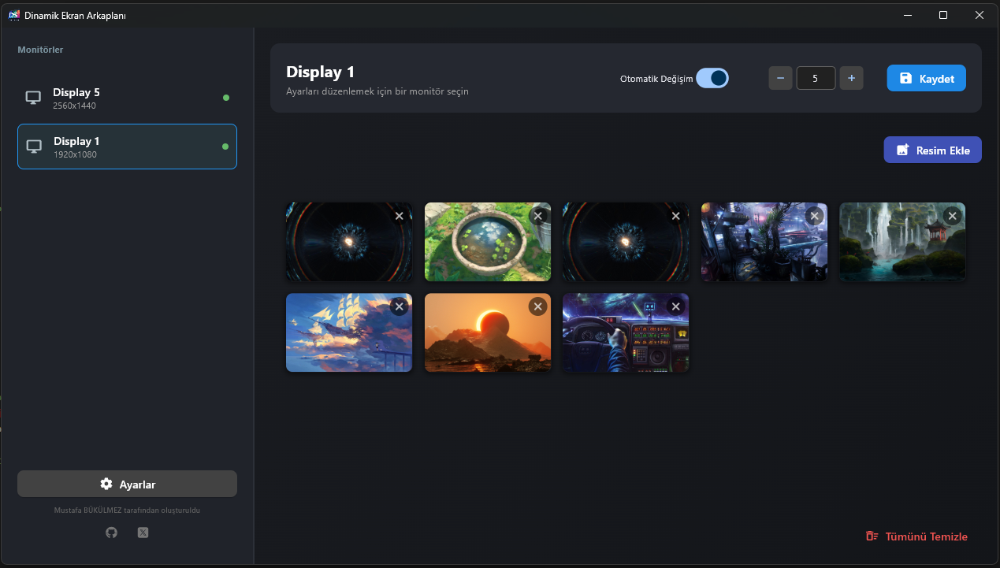

# 🖼️ Dynamic Screen BG - Dynamic Wallpaper Manager

**[🇹🇷 Türkçe](README_TR.md)** | **[🇬🇧 English](README_EN.md)**

---

**Dynamic Screen BG** is an advanced wallpaper management tool with a modern interface, specifically designed for multi-monitor setups. Manage each monitor independently, create galleries, and automatically refresh your screens' atmosphere.

## 🌟 Key Features

### 🖥️ Multi-Monitor Management
- **Automatically detects** all monitors connected to the system
- **Independent gallery** and **timer** settings for each monitor
- Smart **image stitching** technology for monitors with different resolutions
- Create separate wallpaper collections for each monitor

### 🎨 Modern and User-Friendly Interface
- **Dark Theme:** Eye-friendly, elegant, and modern color palette
- **Drag & Drop:** Easily reorder images in the gallery by dragging and dropping
- **Number Stepper:** Precise and easy-to-use numeric control for time settings
- **Compact Design:** Header and sidebar areas designed with modern icons and layout
- **Real-Time Preview:** See changes instantly

### ⚙️ System Features
- **System Tray Integration:** 
  - Application minimizes to system tray when closed
  - Right-click menu: Show Application / Exit
  - Continues running in the background
- **Windows Integration:** Custom application icon (`icon.ico`)
- **Persistent Settings:** All preferences and galleries are automatically saved (`monitor_config.json`)
- **Log System:** Monitor application activities (can be toggled on/off)

### 🌍 Multi-Language Support
- Full support for **Turkish** and **English**
- Instant language switching from settings menu
- Language preference is automatically saved

### 🎯 Automatic Wallpaper Changing
- Customizable timer per monitor (in seconds)
- Independent active/inactive control for each monitor
- Sequential image rotation (circular rotation)
- Start and stop wallpaper changes at any time

## 📸 Screenshots

| Main Screen and Gallery 1 | Main Screen and Gallery 2 |
|:-----------------------:|:--------------:|
|  |  |

*Note: You can add screenshots to the `screenshots` folder.*

## 🚀 Installation and Running

### System Requirements
- **Operating System:** Windows 10/11
- **Python:** 3.10 or higher (for running from source)
- **RAM:** Minimum 2GB
- **Disk Space:** ~50MB (for installation)

### Required Libraries
```
flet>=0.21.0          # Modern UI Framework
Pillow>=9.0.0         # Image processing
pystray>=0.19.0       # System tray
pywin32>=305          # Windows API
comtypes>=1.1.10      # COM API
```

### Step-by-Step Installation

#### 1. Running from Source
```bash
# Clone or download the project
git clone https://github.com/MustafaBKLZ/DynamicScreenBG.git
cd DynamicScreenBG

# Install required libraries
pip install -r requirements.txt

# Run the application
python main.py
```

**Alternative:** Double-click the `baslat.bat` file.

#### 2. Building EXE (Standalone)
```bash
# Start the build process
build_exe.bat
```
This process:
- Installs required packages (`flet`, `pyinstaller`)
- Packages the application into a single `.exe` file
- Creates `DynamicScreenBG.exe` in the `dist` folder
- Includes all resources (locales, icons, SVG files)

**Note:** The EXE file runs on other computers without Python installation.

## 📖 User Guide

### First Run
1. When you start the application, your monitors will be listed on the left
2. Select a monitor (click on it)
3. Click the **"Add Images"** button in the top right corner
4. Select images for the gallery (multiple selection supported)
5. Enable the **"Auto Change"** switch
6. Set the change interval (in seconds)
7. Click the **"Save"** button

### Image Sorting
- **Drag and drop** images in the gallery to reorder them
- Delete images using the **X** button on each image
- Clear the entire gallery with the **"Clear All"** button

### Settings Menu
- **Language Change:** Turkish ↔ English
- **Log Display:** Toggle the log panel on/off
- All settings are automatically saved

### System Tray Usage
- When you close the window, the application continues running in the background
- **Right-click** the system tray icon to:
  - Reopen the application
  - Exit completely

## 🛠️ Technical Details

### Architecture and Technologies
```
┌─────────────────────────────────────────┐
│           Flet UI (Flutter)             │  ← Modern, responsive UI
├─────────────────────────────────────────┤
│      App Logic (main.py)             │  ← Main application logic
├─────────────────────────────────────────┤
│  Wallpaper Service (wallpaper_service)  │  ← Monitor and wallpaper management
├─────────────────────────────────────────┤
│    Windows API (pywin32, ctypes)        │  ← System integration
└─────────────────────────────────────────┘
```

### Used Libraries
- **[Flet](https://flet.dev/):** Flutter-based Python UI framework
- **[Pillow (PIL)](https://pillow.readthedocs.io/):** Image processing, resizing, center-crop, image stitching
- **[pystray](https://pystray.readthedocs.io/):** System tray integration
- **[pywin32](https://github.com/mhammond/pywin32):** Windows API access (`SystemParametersInfoW`, `EnumDisplayMonitors`)

### Image Processing Algorithm
1. **Monitor Detection:** All monitors and their positions are detected using `EnumDisplayMonitors`
2. **Image Sizing:** Each image is resized according to the target monitor's aspect ratio
3. **Center Crop:** Excess areas are cropped and the image is centered
4. **Stitching:** All monitor images are combined on a single canvas
5. **System Wallpaper:** The combined image is set as the Windows wallpaper

### Configuration File
`monitor_config.json` structure:
```json
{
  "app_settings": {
    "language": "en",
    "show_logs": true
  },
  "\\\\.\\DISPLAY1": {
    "images": ["C:/path/to/image1.jpg", "C:/path/to/image2.jpg"],
    "interval": 60,
    "enabled": true,
    "last_index": 0
  }
}
```

### Thread Management
- **Main Thread:** UI rendering and user interaction
- **Background Timer Thread:** Timer control and wallpaper updates for each monitor
- **System Tray Thread:** System tray icon management

## 🔧 Developer Notes

### Code Structure
```
DynamicScreenBG/
├── main.py              # Main application and UI
├── wallpaper_service.py    # Service layer
├── locales/                # Language files
│   ├── tr.json
│   └── en.json
├── monitor_config.json     # User settings (automatic)
├── icon.ico                # Application icon
├── github.svg              # GitHub icon
├── x.svg                   # X (Twitter) icon
├── requirements.txt        # Python dependencies
├── baslat.bat          # Run script
└── build_exe.bat       # Build script
```

### Custom UI Components
- **`NumberStepper`:** Numeric input with increment/decrement buttons
- **`MonitorCard`:** Monitor cards in the sidebar
- **`LanguageManager`:** Multi-language support system

### Adding New Features
1. Edit the `main.py` / `App` class for UI changes
2. Edit the `wallpaper_service.py` / `WallpaperService` class for service logic
3. Update `locales/tr.json` and `locales/en.json` for new language strings

## 🐛 Known Issues and Solutions

### Issue: EXE not running
**Solution:** Windows Defender or your antivirus software may be blocking it. Add the application to your trusted list.

### Issue: Wallpaper not changing
**Solution:** 
- Make sure the "Auto Change" switch is enabled
- Ensure you have added at least 2 images
- Open the log panel and check for error messages

### Issue: Monitor not detected
**Solution:** Restart the application. If the problem persists, make sure the monitor is active in Windows display settings.

## 🤝 Contributing

We welcome your contributions! Please:
1. Fork the project
2. Create a feature branch (`git checkout -b feature/amazing-feature`)
3. Commit your changes (`git commit -m 'Add amazing feature'`)
4. Push to your branch (`git push origin feature/amazing-feature`)
5. Create a Pull Request

## 📝 Changelog

### v2.0.0 (Current)
- ✨ Modern Flet UI
- ✨ Multi-language support (TR/EN)
- ✨ Drag & drop gallery sorting
- ✨ Log system
- ✨ System tray integration
- 🐛 Monitor detection improvements

## 📄 License

This project is open source and can be used freely.

---

<div align="center">

**Developer: Mustafa Bükülmez**

[](https://github.com/MustafaBKLZ)
[](https://x.com/BukulmezMustafa)

</div>
